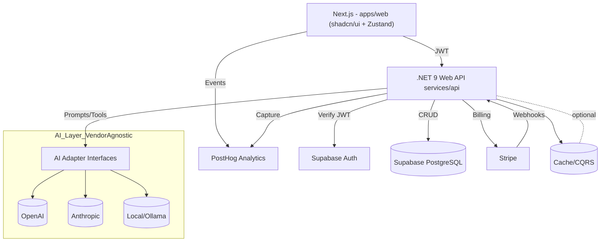

# Architecture (Mermaid)

A high-level view of the web, API, data, analytics, billing, and AI layers.

Notes
- API abstracts AI providers via DI; selection by env config.
- Supabase provides Auth (JWT) and PostgreSQL with RLS for tenancy.
- PostHog captures client and server events.
- Stripe manages subscriptions; webhooks sync entitlements.
