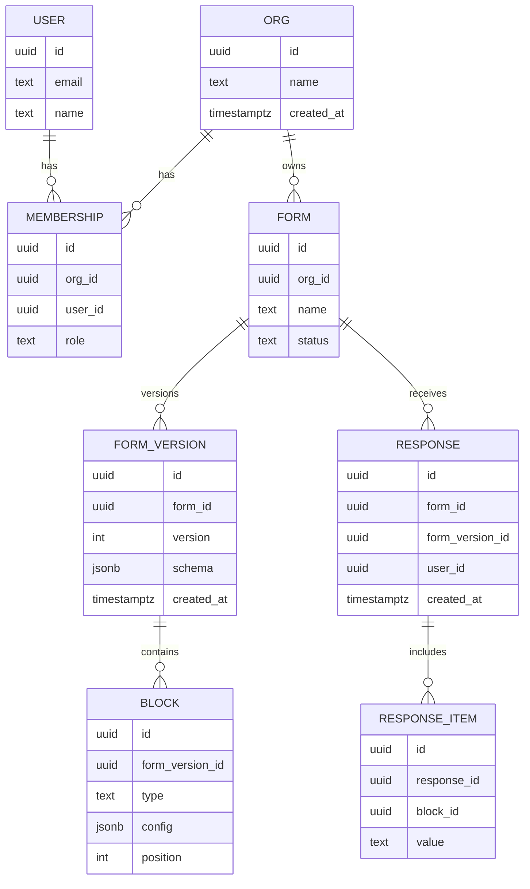

# Data Model (Mermaid ER)

Supabase (PostgreSQL) entities and relationships for multi-tenant forms.

Notes
- Enforce tenant isolation with RLS: `org_id = auth.org_id()` where applicable.
- Consider partial indexes on `form_id`, `created_at` for response queries.
