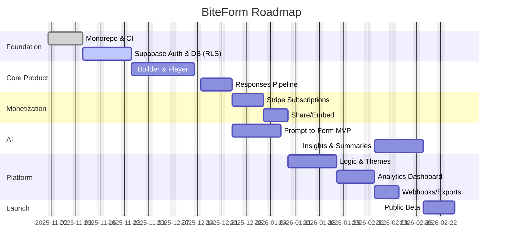

# Roadmap (Mermaid)

The Gantt below mirrors the milestones in `NEXT_STEPS.md`.

```mermaid
gantt
  title BiteForm Roadmap
  dateFormat  YYYY-MM-DD
  excludes    weekends

  section Foundation
  Monorepo & CI            :done,   m1a, 2025-11-01, 7d
  Supabase Auth & DB (RLS) :active, m1b, after m1a, 10d

  section Core Product
  Builder & Player         :m1c, after m1b, 14d
  Responses Pipeline       :m1d, after m1c, 7d

  section Monetization
  Stripe Subscriptions     :m2a, after m1d, 7d
  Share/Embed              :m2b, after m2a, 5d

  section AI
  Prompt-to-Form MVP       :m2c, after m1d, 10d
  Insights & Summaries     :m4a, after m3b, 10d

  section Platform
  Logic & Themes           :m3a, after m2b, 10d
  Analytics Dashboard      :m3b, after m3a, 7d
  Webhooks/Exports         :m3c, after m3b, 5d

  section Launch
  Public Beta              :m4b, after m4a, 7d
```

Visualization options are listed in `docs/VISUALIZATION.md`.
